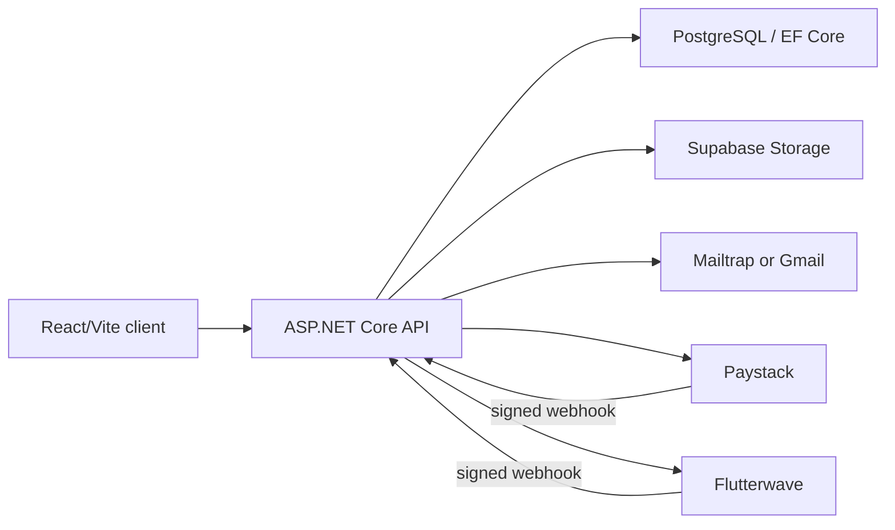

# Architecture

Campus Events is a React/Vite single-page application backed by an ASP.NET Core API and PostgreSQL through EF Core. Supabase Storage holds images and generated certificates. Email delivery uses the configured Mailtrap or Gmail provider. Paid checkout is routed through Paystack or Flutterwave.

Events are the central aggregate. An event belongs to one user, contains ticket tiers, registrations, payment orders, an optional voting campaign, coupons, and optional booking-request provenance. Registrations connect attendees to events and produce signed QR tickets, short ticket codes, attendance state, and certificates. Voting has campaigns, categories, nominees, free votes, and paid vote orders. Booking requests can be assigned to an organizer and converted into an unpublished event draft. Organizer-directory profiles are user-owned and become publicly visible only after the user owns an event and opts in.

The API performs all authorization, price/discount calculation, capacity reservation, payment verification, and image ownership checks. The client’s validation is for usability only.
