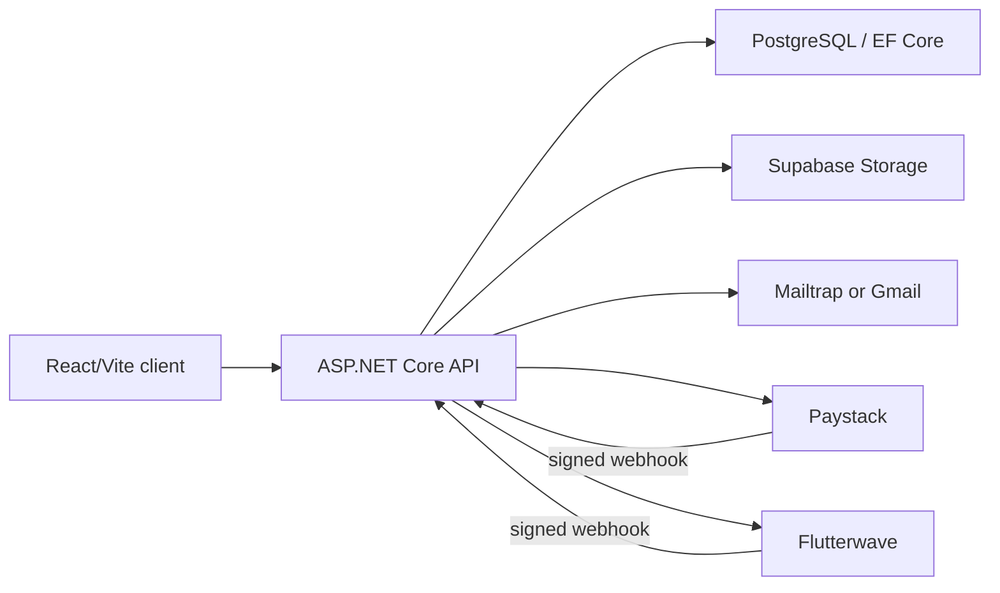

# Architecture

Campus Events is a React/Vite single-page application backed by an ASP.NET Core API and PostgreSQL through EF Core. Supabase Storage holds images and generated certificates. Email delivery uses the configured Mailtrap or Gmail provider. Paid checkout is routed through Paystack or Flutterwave.

Events are the central aggregate. An event belongs to one owner and contains ticket tiers, registrations, payment orders, an optional voting campaign, coupons, optional booking-request provenance, and zero or more `EventTeamMember` records. Each team record links an existing active ordinary account to one event, records who invited it, and assigns `Admin`, `Member`, or `CheckInStaff`. Registrations connect attendees to events and produce signed QR tickets, short ticket codes, attendance state, and certificates. Voting has campaigns, categories, nominees, free votes, and paid vote orders. Organizer-directory profiles are user-owned and become publicly visible only after the user owns an event and opts in.

Commissioning extends `BookingRequest` with a structured brief, a hashed anonymous tracking token, one assigned organizer, and optional private-draft provenance. `BookingRequestQuote` is a one-to-one record containing that organizer's proposed GHS fee, timeline, message, and submission time; the design does not implement competing bids. `BookingRequestStatusHistory` is a one-to-many append-only lifecycle trail with status, note, and timestamp. The status model adds `Quoted` between assignment and acceptance and records `Submitted`, `UnderReview`, `SentToOrganizer`, `Quoted`, `Accepted`, `Declined`, `Converted`, and `Closed`. Quote acceptance creates the unpublished event draft, preserving the existing commissioning-to-event boundary; publishing that linked draft records `Converted`.

The API performs all authorization, price/discount calculation, capacity reservation, payment verification, and image ownership checks. `EventAuthorizationService` resolves event actions into capabilities (`ViewAttendees`, `CheckIn`, `Edit`, `ManageOperations`, `ViewRevenue`, `ManageTeam`, and `Delete`) and grants them in order to platform Admins, the event owner, or an eligible team role. `EventTeamController` exposes access discovery, team management, and restricted revenue access under `/api/events/{eventId}`. The client’s validation and permission-based presentation are for usability only.
